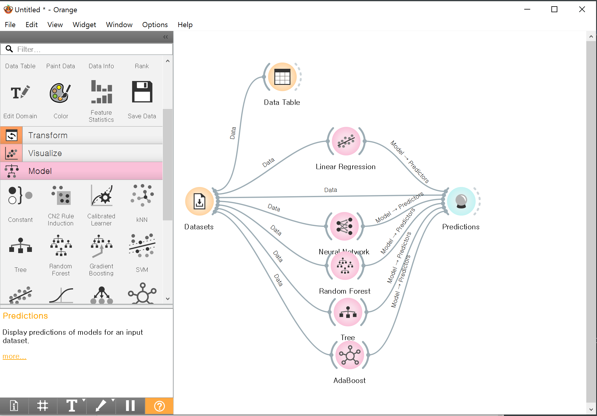
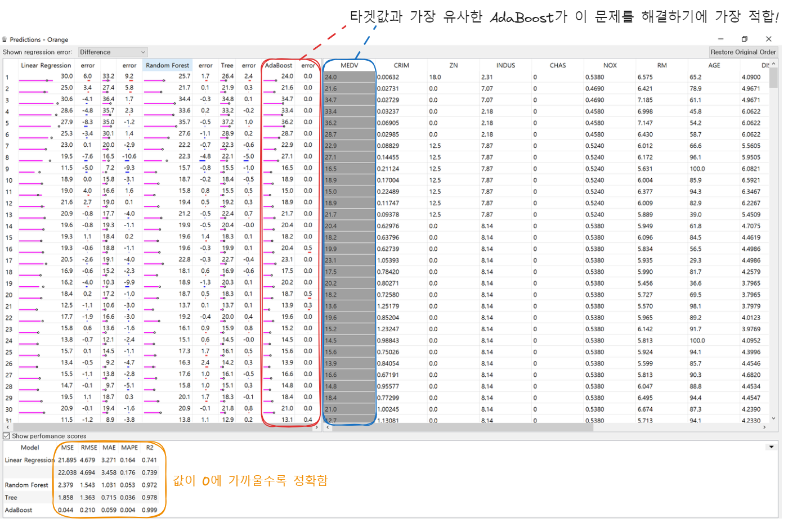

# 수업내용
## 인공지능에 대한 이해
### Teachable Machine을 활용한 실습
나는 강아지상일까? 고양이상일까?
https://teachablemachine.withgoogle.com/models/jcXZ7SlVH/

## 인공지능 학습 및 모델링 실습
### 오렌지 설치 및 사용
오렌지를 활용한 데이터 분석 - 주택가격 예측

어떤 알고리즘이 문제 해결에 가장 적합한지 알아본다. 
알고리즘별로 예측값이 다르게 나타남을 확인할 수 있다.

